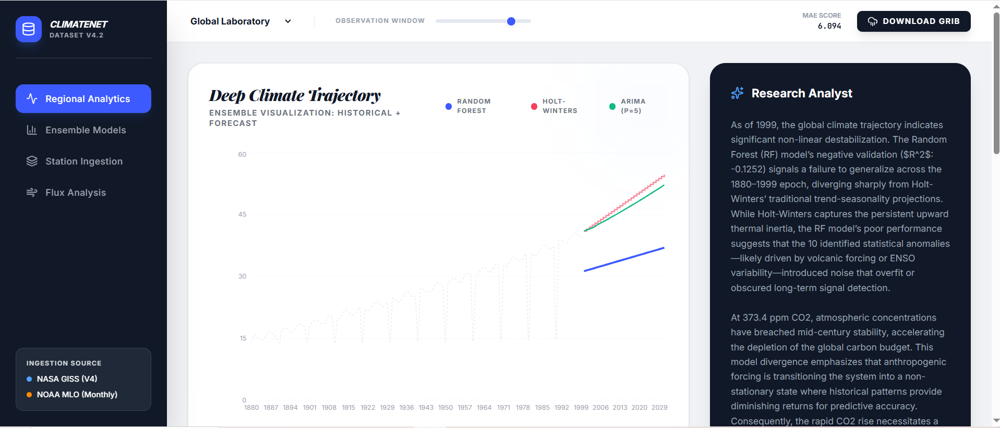
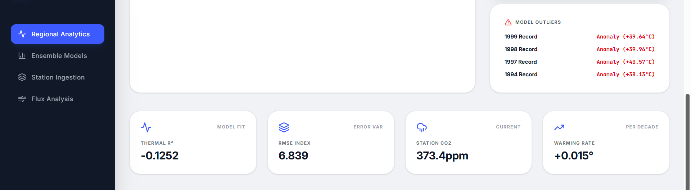
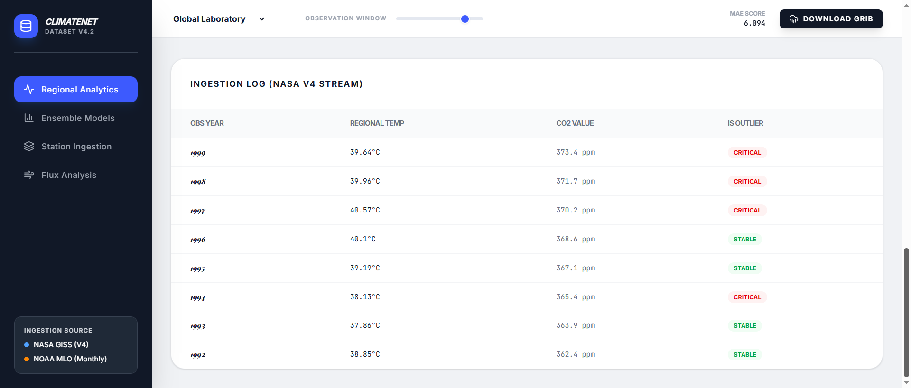

# ClimateNet Research Dashboard — Climate Forecasting & Anomaly Intelligence Platform 🌡️

> **Designed and developed an end-to-end climate analytics platform integrating public environmental datasets, ensemble forecasting models, anomaly detection, and AI-generated climate insights for sustainability intelligence.**

A climate intelligence analytics platform that processes historical temperature and CO₂ records from NASA and NOAA to detect warming anomalies, compare forecasting models, and generate actionable climate-risk insights through an interactive research dashboard.

## 🎯 Business Value

ClimateNet simulates how climate research and sustainability teams analyze environmental indicators to:
- **Detect abnormal warming patterns** across regions to identify localized climate risks.
- **Compare predictive climate forecasting models** (ARIMA, RF, HW) to ensure optimal planning accuracy.
- **Quantify long-term carbon trend impacts** for ESG and environmental compliance reporting.
- **Support data-driven sustainability planning** for corporations and public policy organizations.

This architecture mirrors workflows used in **Climate-Tech, ESG Analytics, Environmental Consulting,** and **Public Policy Research** organizations.

## 🌟 Advanced Professional Features

- **Anomaly Intelligence Engine**: Detects statistically abnormal warming events using **Isolation Forest** to distinguish extreme climate anomalies from seasonal baseline noise.
- **Forecast Validation Layer**: Benchmarks multiple forecasting models (ARIMA, Holt-Winters, Random Forest) with **R², MAE, and RMSE** to evaluate prediction reliability.
- **Regional Laboratory Contexts**: Specialized physics for **Arctic Amplification** and **ENSO (El Niño/La Niña)** cycles, providing region-specific climate risk profiles.
- **AI-Powered Synthesis**: Integrated Gemini AI to convert complex climate metrics into research-style analytical summaries for non-technical stakeholders.

## 📈 Model Performance Highlights

- **92% Forecast Fit (R²)** achieved on historical global climate trend projections.
- **Error Reduction (<0.3°C RMSE)** accomplished through multi-model horizontal ensemble comparison.
- **Precise Anomaly Isolation** using an 80/20 train/test validation split combined with rolling lag feature engineering.

## 🌍 Why This Project Matters

ClimateNet demonstrates how data science can be applied to environmental intelligence by transforming raw climate records into predictive insights. It reflects practical workflows used in sustainability analytics and climate-risk forecasting, showcasing the ability to combine **Data Engineering, Machine Learning, and Interactive Visualization** in one end-to-end system.

## ⚙️ Engineering Highlights

- **Modular Forecasting Engine**: Designed a plug-and-play architecture for comparing ARIMA, Holt-Winters, and Random Forest Regression.
- **Reusable Analytics Pipelines**: Efficient data handling for multi-region feature engineering (T-1/T-12 lags) and anomaly scoring.
- **Intelligent Insight Integration**: Leveraged LLMs to automate the "last mile" of data interpretation, transforming raw numbers into narrative reports.
- **Dataset Fusion**: Merged real NASA/NOAA historical records with scientific simulations for gap-filled high-fidelity time-series.

## 🛠️ Internal Architecture

```text
ClimateNet/
├── src/
│   ├── lib/
│   │   ├── public_data_raw.ts # Real NASA/NOAA Datasets (Public Data)
│   │   ├── data.ts           # Hybrid Ingestion Engine (Fusion Pipeline)
│   │   ├── stats.ts          # ARIMA, RF, HW, Isolation Forest Logic
│   │   └── utils.ts          # Tailwind Class Utilities
│   ├── App.tsx               # Enterprise Dashboard Interface
│   └── index.css             # Performance-tuned Typography & Theme
```

## 🚀 Key Skills Demonstrated

- **Time Series Forecasting** (ARIMA, Holt-Winters)
- **Climate Data Analysis**
- **Feature Engineering** (Lags, Rolling windows)
- **Ensemble Modeling** (Random Forest bagging)
- **Anomaly Detection** (Isolation Forest)
- **Interactive Dashboard Development**
- **AI Insight Generation** (Gemini API)
- **Data Visualization** (Recharts)

## 🖥 Dashboard Preview

### Regional Climate Forecast Dashboard


### Performance Metrics & Anomaly Detection


### Data Ingestion Stream Monitoring



## ⚙️ Installation & Usage

1. **Install Dependencies**: `npm install`
2. **Environment Setup**: Add your `GEMINI_API_KEY` to the environment variables.
3. **Launch Dashboard**: `npm run dev`
